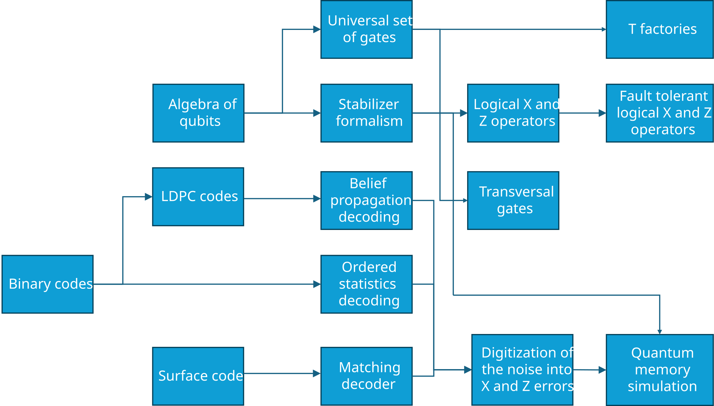

# Quantum Error Correcting Codes, mainly decoding them

June 2026 update - If you haven't already, I would urge you to look at Daniel Gottesman's book:  Surviving as a Quantum Computer in a Classical World.I 

This is the entry point to this repository. Hopefully, it would allow the reader who knows some classical ECC and some linear algebra to understand how to carry their knowledge from classical ECC to quantum ECC.

I found that most books teach Quantum computing, maybe some Quantum mechanics, and at the very end give some qECC examples (with the obvious exception of Daniel Gottesman's brilliant page turner:  [Surviving as a Quantum Computer in a Classical World](https://www.cs.umd.edu/~dgottesm/) which is not only very clear, but is also very funny and an absolute joy to read !).

I'm hoping to do the opposite, i.e., first get the reader to master qECC, then learn some quantum computing where qECC are used.

So far I have the following technology tree (if you ever played Civilisation):

## Some pointers
To start reading, go to:

[linearCodesOverF2.ipynb](./1%20linearCodesOverF2.ipynb) - that should calibrate you to notation and some basic ideas from classical error correcting codes.

Then the most natural place to continue is: [orderedStatisticsDecoding.ipynb](./2%20orderedStatisticsDecoding.ipynb) which doesn't require more than linear algebra over $F_2$.

Next review an implementation of a belief propagation decoder in [minSumExample.ipynb](./3%20minSumExample.ipynb) and you can check under the hood in minSum.py

[beliefPropagationAndOsd.ipynb](4%20beliefPropagationAndOsd.ipynb)

polinomialCodes.py contains codes that were introduced in a paper by Panteleev and Kalachev, but also IBM
relaybp.py is my own implementation of relay BP from a paper by IBM.

## Where to find thing (glossary ?)

1. Decoder outcomes (logical error rate, failure, error) discussed in quaternaryBeliefPropagationAndOsd.

2. The methodology to evaluate codes and decoders is explained first in the abscence of a decoder in the noise.ipynb nootebook.

3. Evaluation of codes and decoders are done in utils.py, and saved to npy files, which are later post processed in postProcessing.py.

4. The logical operators of a code are computed in logicals.py

5. A first attempt at an environment for bivariate bicycle codes is at bb_gym.py, this is a stateless environment. 

6. A non parallel reinfocrement learning using PPO is at reinforcementLearning.py. This is then made into a PPO that uses multiple environments in parallel in reinforcementLearningParallel.py

